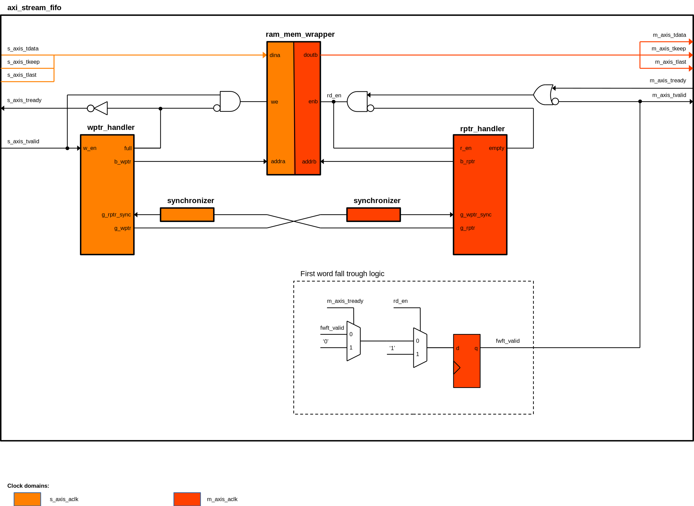

# axis_fifo

## Description
AXI Stream FIFO implementation with dual clock RAM memory

**Functionality:**
- Vendor specific RAM memory implementation
- AXI Stream slave/master ports
- Variable width and depth
- Asynchronous clocks 
- FULL/EMPTY flags **TODO**
- Packet mode **TODO**
- WR_COUNT, RD_COUNT **TODO**

Detailed IO port description and waveforms can be found **TODO**

## Main block diagram:

