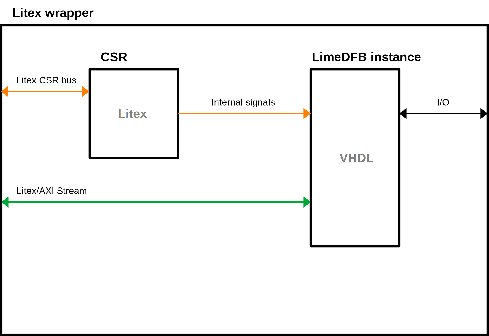

# Creating LiteX wrppers


##  Introduction

Wrapping a VHDL/Verilog module in LiteX allows you to integrate custom hardware modules written in VHDL/Verilog into a Python-based SoC design using Migen and LiteX. Below is a step-by-step guide on how to do this using the gpio_top module as an example.

## 1. Prerequisites

* Python installed with LiteX
* Familiarity with VHDL/Verilogmodule structure
* Your custom VHDL/Verilog module (e.g. gpio_top.vhd)
* Basic knowledge of LiteX's CSR (Control and Status Registers)

### 1.1 What a LiteX Wrapper Should Contain


* **LiteX CSRs**  - ``CSRStorage()`` and ``CSRStatus()`` to allow software (e.g., a CPU in the SoC) to control and observe hardware behavior.

* **Internal Signals** - ``Signal()`` mapped to your HDL module’s inputs/outputs for communication.

* **HDL Instance** - An instantiation of the HDL module using ``Instance(...)`` in Migen, with proper connection of generics and ports.

* **I/O Buffers (optional)** - For bidirectional I/O (e.g., using ``IOBUF`` on Xilinx FPGAs).

* **Include HDL sources**  - HDL files must be registered with the platform using ``platform.add_source()``.




## 2. Adding Litex CSRs

LiteX CSRs will be used in software (e.g., a CPU in the SoC) to control and observe hardware behavior.  ``CSRStorage()`` is a writable register (from software to hardware) and ``CSRStatus()``  is readable register:

```python
self.gpio_override = CSRStorage(width, description="Enable GPIO override")
self.gpio_val = CSRStatus(width, description="Current GPIO input value")
```

To access CSRs in hardware and assign them to internal signals:
```python
       # Assign GPIO current value to status register
        self.comb += [
            self.gpio_val.status.eq(self.GPIO_IN_VAL),
        ]
```        

Here ``gpio_override`` value is directly mapped to HDL module port:

```python
        # Create instance and assign params
        self.specials += Instance("gpio_top",
            # ....
            i_GPIO_OVERRIDE     = self.gpio_override.storage,  
            # ....
        )
        
```
## 3. Internal signals

For example VHDL uses ``std_logic`` or ``std_logic_vector`` they are equivalent to ``Signal()`` and ``Signal(nbits)`` in LiteX.

Example:
```python 
self.GPIO_DIR     = Signal(len(pads))
```


## 4. HDL module instance

Before creating a LiteX wrapper, thoroughly analyze your VHDL module's interface. You need to identify and map all generics, ports, directions, and signal types to their LiteX/Migen equivalents.

VHDL module interface: 

```vhdl
entity gpio_top is
   generic (
      G_GPIO_WIDTH : integer := 8
   );
   port (
      GPIO_DIR          : in  std_logic_vector(G_GPIO_WIDTH-1 downto 0);
      GPIO_OUT_VAL      : in  std_logic_vector(G_GPIO_WIDTH-1 downto 0);
      GPIO_IN_VAL       : out std_logic_vector(G_GPIO_WIDTH-1 downto 0);
      GPIO_OVERRIDE     : in  std_logic_vector(G_GPIO_WIDTH-1 downto 0);
      GPIO_OVERRIDE_DIR : in  std_logic_vector(G_GPIO_WIDTH-1 downto 0);
      GPIO_OVERRIDE_VAL : in  std_logic_vector(G_GPIO_WIDTH-1 downto 0);
      GPIO_I            : in  std_logic_vector(G_GPIO_WIDTH-1 downto 0);
      GPIO_O            : out std_logic_vector(G_GPIO_WIDTH-1 downto 0);
      GPIO_T            : out std_logic_vector(G_GPIO_WIDTH-1 downto 0)
   );
end gpio_top;
```

LiteX equivalent:
```python
        self.specials += Instance("gpio_top",
            # Assign generics
            p_G_GPIO_WIDTH      = len(pads),
            # Assign ports
            i_GPIO_DIR          = self.GPIO_DIR,
            i_GPIO_OUT_VAL      = self.GPIO_OUT_VAL,
            o_GPIO_IN_VAL       = self.GPIO_IN_VAL,
            i_GPIO_OVERRIDE     = self.gpio_override.storage,
            i_GPIO_OVERRIDE_DIR = self.gpio_override_dir.storage,
            i_GPIO_OVERRIDE_VAL = self.gpio_override_val.storage,
            i_GPIO_I            = self.GPIO_I,
            o_GPIO_O            = self.GPIO_O,
            o_GPIO_T            = self.GPIO_T
        )
```


* **Generics** - In LiteX, these become ``p_<GENERIC_NAME>`` in the ``Instance(...)`` call.

* **Input ports**  - ``i_<name>``

* **Output prots** - ``o_<name>``
* **Bidirectional ports** - ``io_<name>``

## 5. Include HDL sources

To add hdl source ``platform.add_source()`` should be used:

```python
platform.add_source("./gateware/LimeDFB/gpio_top/src/gpio_top.vhd")
```

## 5. Complete example


```python
#
# This file is part of LimeSDR_GW.
#
# Copyright (c) 2024-2025 Lime Microsystems.
#
# SPDX-License-Identifier: Apache-2.0

from migen import *

from litex.gen import *

from litex.soc.interconnect.csr import *

# GPIO Top -----------------------------------------------------------------------------------------

class GpioTop(LiteXModule):
    def __init__(self, platform, pads):
        self.GPIO_DIR     = Signal(len(pads))
        self.GPIO_OUT_VAL = Signal(len(pads))
        self.GPIO_IN_VAL  = Signal(len(pads))

        # CSRs
        self.gpio_override = CSRStorage(len(pads),
            description="GPIO Mode: 0: normal operation, 1: control is overriden."
        )
        self.gpio_override_dir = CSRStorage(len(pads),
            description="GPIO override direction: 0: Output, 1: Input."
        )
        self.gpio_override_val = CSRStorage(len(pads),
            description="GPIO Logic level: 0: High, 1: Low. (Dir must be set to output)"
        )
        self.gpio_val = CSRStatus(size=len(pads), description="GPIO current value")

        # # #

        # Signals.
        self._pads  = Signal(len(pads))
        self.GPIO_I = Signal(len(pads))
        self.GPIO_O = Signal(len(pads))
        self.GPIO_T = Signal(len(pads))

        # Assign GPIO current value to status register
        self.comb += [
            self.gpio_val.status.eq(self.GPIO_IN_VAL),
            pads.eq(self._pads),
        ]

        # Create instance and assign params
        self.specials += Instance("gpio_top",
            # Assign generics
            p_G_GPIO_WIDTH      = len(pads),
            # Assign ports
            i_GPIO_DIR          = self.GPIO_DIR,
            i_GPIO_OUT_VAL      = self.GPIO_OUT_VAL,
            o_GPIO_IN_VAL       = self.GPIO_IN_VAL,
            i_GPIO_OVERRIDE     = self.gpio_override.storage,
            i_GPIO_OVERRIDE_DIR = self.gpio_override_dir.storage,
            i_GPIO_OVERRIDE_VAL = self.gpio_override_val.storage,
            i_GPIO_I            = self.GPIO_I,
            o_GPIO_O            = self.GPIO_O,
            o_GPIO_T            = self.GPIO_T
        )

        # Xilinx bidirectional buffer primitive
        for n in range(len(pads)):
            self.specials += Instance("IOBUF",
                o_O     = self.GPIO_I[n],
                io_IO   = self._pads[n],
                i_I     = self.GPIO_O[n],
                i_T     = self.GPIO_T[n]
            )

        platform.add_source("./gateware/LimeDFB/gpio_top/src/gpio_top.vhd")


```


