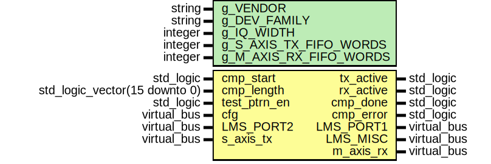
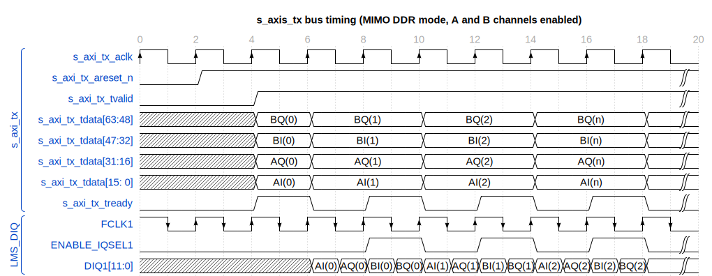

# Entity: lms7002_top 
- **File**: lms7002_top.vhd

## Diagram

## Description

Top module for LMS7002M IC.

Functionality: - Transmit IQ samples trough s_axi_tx AXI Stream bus - Receive IQ samples from m_axi_rx AXI Stream bus

LimeLight digital modes implemented: - TRXIQ PULSE - MIMO DDR - SISO DDR - SISO SDR

 

 

 

 

 

 

 

 

 

 

## Generics

| Generic name           | Type    | Value     | Description           |
| ---------------------- | ------- | --------- | --------------------- |
| g_VENDOR               | string  | "XILINX"  |                       |
| g_DEV_FAMILY           | string  | "Artix 7" | Device family         |
| g_IQ_WIDTH             | integer | 12        | IQ bus width          |
| g_S_AXIS_TX_FIFO_WORDS | integer | 16        | TX FIFO size in words |
| g_M_AXIS_RX_FIFO_WORDS | integer | 16        | RX FIFO size in words |

## Ports

| Port name    | Direction | Type                          | Description                     |
| ------------ | --------- | ----------------------------- | ------------------------------- |
| tx_active    | out       | std_logic                     | TX antenna enable flag          |
| rx_active    | out       | std_logic                     | RX sample counter enable        |
| cmp_start    | in        | std_logic                     | Start sample comparison         |
| cmp_length   | in        | std_logic_vector(15 downto 0) | Number of samples to compare    |
| cmp_done     | out       | std_logic                     | Sample comparison done          |
| cmp_error    | out       | std_logic                     | Sample comparison error         |
| test_ptrn_en | in        | std_logic                     |                                 |
| cfg          | in        | Virtual bus                   | Configuration bus               |
| LMS_PORT1    | out       | Virtual bus                   | interface                       |
| LMS_PORT2    | in        | Virtual bus                   | interface                       |
| LMS_MISC     | out       | Virtual bus                   | LMS miscellaneous control ports |
| s_axis_tx    | in        | Virtual bus                   | Transmit AXIS bus               |
| m_axis_rx    | out       | Virtual bus                   | Receive AXIS bus                |

### Virtual Buses

#### cfg

| Port name              | Direction | Type                         | Description                    |
| ---------------------- | --------- | ---------------------------- | ------------------------------ |
| CFG_TX_EN              | in        | std_logic                    |                                |
| CFG_TRXIQ_PULSE        | in        | std_logic                    |                                |
| CFG_DDR_EN             | in        | std_logic                    |                                |
| CFG_MIMO_INT_EN        | in        | std_logic                    |                                |
| CFG_CH_EN              | in        | std_logic_vector(1 downto 0) |                                |
| CFG_LMS_TXEN           | in        | std_logic                    |                                |
| CFG_LMS_TXRXEN_MUX_SEL | in        | std_logic                    |                                |
| CFG_LMS_RXEN           | in        | std_logic                    |                                |
| CFG_LMS_RESET          | in        | std_logic                    |                                |
| CFG_LMS_TXRXEN_INV     | in        | std_logic                    |                                |
| CFG_LMS_CORE_LDO_EN    | in        | std_logic                    |                                |
| CFG_LMS_TXNRX1         | in        | std_logic                    |                                |
| CFG_LMS_TXNRX2         | in        | std_logic                    | Signals from FPGACFG registers |
#### LMS_PORT1

| Port name     | Direction | Type                                    | Description                  |
| ------------- | --------- | --------------------------------------- | ---------------------------- |
| MCLK1         | in        | std_logic                               | TX interface clock           |
| FCLK1         | out       | std_logic                               | TX interface feedback clock  |
| DIQ1          | out       | std_logic_vector(g_IQ_WIDTH-1 downto 0) | DIQ1 data bus                |
| ENABLE_IQSEL1 | out       | std_logic                               | IQ select flag for DIQ1 data |
| TXNRX1        | out       | std_logic                               | LMS_PORT1 direction select   |
#### LMS_PORT2

| Port name     | Direction | Type                                    | Description                  |
| ------------- | --------- | --------------------------------------- | ---------------------------- |
| MCLK2         | in        | std_logic                               | RX interface clock           |
| FCLK2         | out       | std_logic                               | RX interface feedback clock  |
| DIQ2          | in        | std_logic_vector(g_IQ_WIDTH-1 downto 0) | DIQ2 data bus                |
| ENABLE_IQSEL2 | in        | std_logic                               | IQ select flag for DIQ2 data |
| TXNRX2        | out       | std_logic                               | LMS_PORT2 direction select   |
#### LMS_MISC

| Port name   | Direction | Type      | Description                     |
| ----------- | --------- | --------- | ------------------------------- |
| RESET       | out       | std_logic | LMS hardware reset, active low  |
| TXEN        | out       | std_logic | TX hard power off               |
| RXEN        | out       | std_logic | RX hard power off               |
| CORE_LDO_EN | out       | std_logic | LMS internal LDO enable control |
#### s_axis_tx

| Port name          | Direction | Type                          | Description                   |
| ------------------ | --------- | ----------------------------- | ----------------------------- |
| s_axis_tx_areset_n | in        | std_logic                     | TX interface active low reset |
| s_axis_tx_aclk     | in        | std_logic                     | TX FIFO write clock           |
| s_axis_tx_tvalid   | in        | std_logic                     | TX FIFO write request         |
| s_axis_tx_tdata    | in        | std_logic_vector(63 downto 0) | TX FIFO data                  |
| s_axis_tx_tready   | out       | std_logic                     | TX FIFO write full            |
| s_axis_tx_tlast    | in        | std_logic                     |                               |
#### m_axis_rx

| Port name          | Direction | Type                          | Description                               |
| ------------------ | --------- | ----------------------------- | ----------------------------------------- |
| m_axis_rx_areset_n | in        | std_logic                     | RX interface active low reset             |
| m_axis_rx_aclk     | in        | std_logic                     | RX FIFO read clock                        |
| m_axis_rx_tvalid   | out       | std_logic                     | Received data from DIQ2 port valid signal |
| m_axis_rx_tdata    | out       | std_logic_vector(63 downto 0) | Received data from DIQ2 port              |
| m_axis_rx_tkeep    | out       | std_logic_vector(7 downto 0)  | Received data byte qualifier              |
| m_axis_rx_tready   | in        | std_logic                     |                                           |
| m_axis_rx_tlast    | out       | std_logic                     |                                           |

## Signals

| Name           | Type                                  | Description |
| -------------- | ------------------------------------- | ----------- |
| inst1_txant_en | std_logic                             |             |
| inst1_diq_h    | std_logic_vector(g_IQ_WIDTH downto 0) |             |
| inst1_diq_l    | std_logic_vector(g_IQ_WIDTH downto 0) |             |
| test_diq_h     | std_logic_vector(g_IQ_WIDTH downto 0) |             |
| test_diq_l     | std_logic_vector(g_IQ_WIDTH downto 0) |             |
| inst2_diq_h    | std_logic_vector(g_IQ_WIDTH downto 0) |             |
| inst2_diq_l    | std_logic_vector(g_IQ_WIDTH downto 0) |             |
| lms_txen_int   | std_logic                             |             |
| lms_rxen_int   | std_logic                             |             |
| inst3_diq_h    | std_logic_vector(g_IQ_WIDTH downto 0) |             |
| inst3_diq_l    | std_logic_vector(g_IQ_WIDTH downto 0) |             |
| axis_tx_tvalid | std_logic                             |             |
| axis_tx_tdata  | std_logic_vector(63 downto 0)         |             |
| axis_tx_tready | std_logic                             |             |
| axis_tx_tlast  | std_logic                             |             |
| axis_rx_tvalid | std_logic                             |             |
| axis_rx_tdata  | std_logic_vector(63 downto 0)         |             |
| axis_rx_tkeep  | std_logic_vector(7 downto 0)          |             |
| axis_rx_tready | std_logic                             |             |
| axis_rx_tlast  | std_logic                             |             |

## Instantiations

- inst0_cdc_tx_fifo: work.fifo_axis_wrap
- inst1_0_lms7002_tx: work.lms7002_tx
- inst1_1_tst_ptrn: work.txiq_tst_ptrn
- inst2_lms7002_ddout: work.lms7002_ddout
- inst3_lms7002_ddin: work.lms7002_ddin
- inst4_0_smpl_cmp: work.smpl_cmp
- inst4_1_lms7002_rx: work.lms7002_rx
- inst5_cdc_rx_fifo: work.fifo_axis_wrap
