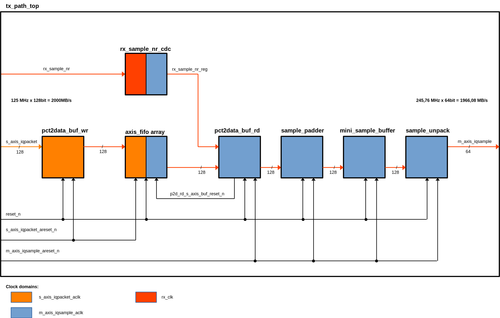

# tx_path_top

## Description
Top module for unpacking stream packets, performing timestamp synchronisation if needed.

**Functionality:**
- Perform timestamp synchronisation
- Unpack stream packets
- Output the data in a format suitable for lms7002_top module

Detailed IO port description and waveforms can be found [here](./tx_path_top.md).

## Main block diagram:

