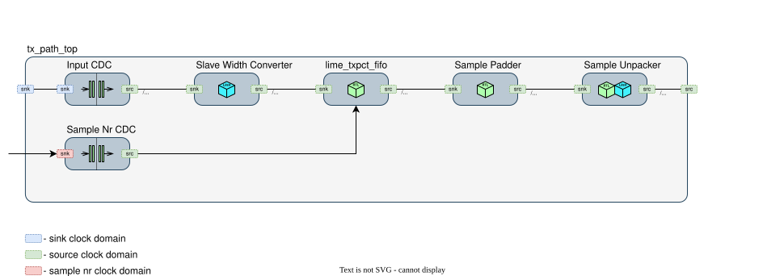

tx_path_top
===================

Description
-----------
Top module for the Transmit (TX) path that accepts packetized IQ data, performs optional timestamp synchronization, adapts sample width, and unpacks payloads into a stream format suitable for the LMS7002/AFE TX datapath.

**Functionality:**
    - Receive packetized IQ data on an AXI-Stream sink.
    - Cross from the sink clock domain to the TX domain using an asynchronous FIFO.
    - Buffer incoming packets into RAM-backed payload and metadata memories to allow timestamp-based alignment and loss handling.
    - Optionally synchronize to an external 64-bit sample counter; drop outdated packets and raise a sticky flag on loss.
    - Pad 12-bit IQ samples to 16-bit (bypass when 16-bit is selected).
    - Unpack 128-bit payload words into a 64-bit or 128-bit TX stream depending on channel mode.

Main block diagram
-----------------------

The top-level TX file integrates the following blocks:

- :ref:`Input CDC (input_buff) <input_cdc>` – Asynchronous FIFO crossing from the sink clock domain to the TX domain.
- :ref:`Slave Width Converter (conv_64_to_128) <slave_width_conv>` – Adapts the sink bus to a fixed 128-bit internal width.
- :ref:`Packet Fifo (lime_txpct_fifo) <lime_txpct_fifo>` - RAM-backed TX packet FIFO used to synchronize TX stream packets with RX timestamps.
- :ref:`Sample Padder (sample_padder) <sample_padder_block>` – Pads 12-bit samples to 16-bit; bypass in 16-bit mode.
- :ref:`Sample Unpacker (SAMPLE_UNPACK / sample_unpack128) <sample_unpack_block>` – Converts 128-bit payload words into the downstream TX stream width and channel ordering.
- :ref:`Sample Nr CDC (smpl_nr_fifo) <sample_nr_cdc>` – Asynchronous FIFO to cross external timestampt to internal clock domain.

Clock domains
^^^^^^^^^^^^^

This module typically operates with three clock/reset domains:

- ``s_clk_domain`` (sink clock domain) — Clock domain of the AXI-Stream sink that feeds packetized IQ data.
- ``m_clk_domain`` (source clock domain) — Main TX processing domain. All packet buffering, padding, and unpacking occur here; the AXI-Stream source also uses this domain.
- ``rx_clk_domain`` (sample nr clock domain) — Domain of the external sample counter input. The sample number is safely transferred into ``m_clk_domain`` via a small CDC FIFO.

Packet format (expected at sink)
^^^^^^^^^^^^^^^^^^^^^^^^^^^^^^^^

TX expects a similar packet structure to RX. A packet consists of a 64-bit header, a 64-bit timestamp, and a payload of up to ``PCT_MAX_SIZE - 16`` bytes. ``PCT_MAX_SIZE`` is usually 4096 Bytes.

+----------------+---------------+------------+----------------------------------------------------------------------------------------+
| Field          | Byte Offset   | Size       | Description                                                                            |
+================+===============+============+========================================================================================+
| Header         | 0 - 7         | 8 Bytes    | General packet header.                                                                 |
+----------------+---------------+------------+----------------------------------------------------------------------------------------+
| Timestamp      | 8 - 15        | 8 Bytes    | 64-bit sample number used for alignment/synchronization.                               |
+----------------+---------------+------------+----------------------------------------------------------------------------------------+
| Payload        | 16 - ...      | up to      | IQ sample payload, interleaved by channels.                                            |
|                |               | PCT_MAX-16 |                                                                                        |
+----------------+---------------+------------+----------------------------------------------------------------------------------------+

When multiple channels are enabled, payload samples are ordered per enabled-channel set (e.g. A-only, A+B, B+D, or A+B+C+D in 4-channel mode). The unpack block converts these payload words to the downstream TX stream format.

.. _input_cdc:

Input CDC (input_buff)
^^^^^^^^^^^^^^^^^^^^^^

The ``input_buff`` is a clock-domain crossing buffer:

- Layout: one field, ``data`` of width ``FIFO_DATA_W`` (default 128).
- From ``s_clk_domain`` to ``m_clk_domain``.
- Depth is derived from ``input_buff_size / FIFO_DATA_W``. The default sizing ensures at least 4 words of buffering for safe CDC.

.. _slave_width_conv:

Slave Width Converter (conv_64_to_128)
^^^^^^^^^^^^^^^^^^^^^^^^^^^^^^^^^^^^^^

Adapts the sink bus to a fixed internal width of 128 bits using ``stream.Converter``. If ``FIFO_DATA_W`` is already 128, the converter behaves as a pass-through.

.. _lime_txpct_fifo:

Packet FIFO (lime_txpct_fifo)
^^^^^^^^^^^^^^^^^^^^^^^^^^^^^

Packet FIFO is a RAM-backed TX packet FIFO used to synchronize TX stream
packets with RX timestamps. It accepts AXI-Stream packets consisting of one
128-bit header followed by 128-bit payload words, stores payload data in shared
payload RAM, and stores packet metadata, including the sample number, in a
separate metadata FIFO.

The oldest committed packet is exposed through ``pct_valid`` / ``pct_header``.
External logic compares the TX packet sample number with the RX timestamp. When
they match, ``pct_rd`` is triggered and Packet FIFO starts streaming the packet.
When the packet is late, ``pct_clr`` is triggered and the module discards the
packet.

Packets with the ``sync_dis`` bit set in the packet header bypass timestamp
synchronization and are streamed automatically as soon as they arrive.

.. _sample_padder_block:

Sample Padder (sample_padder)
^^^^^^^^^^^^^^^^^^^^^^^^^^^^^

Pads 12-bit IQ samples up to 16 bits to match the downstream bus width. Controlled by ``smpl_width`` via an internal ``unpack_bypass`` signal:

- ``smpl_width == 0b00`` → 16-bit mode, padder is bypassed.
- Other values → 12-bit mode, padder inserts zero/sign extension up to 16 bits.

The padder feeds a small 128-bit ``SyncFIFO`` that provides additional decoupling before unpacking.

.. _sample_unpack_block:

Sample Unpack (SAMPLE_UNPACK / sample_unpack128)
^^^^^^^^^^^^^^^^^^^^^^^^^^^^^^^^^^^^^^^^^^^^^^^^

Unpacks 128-bit payload words into the final TX stream format:

- 2-channel mode (default): ``SAMPLE_UNPACK`` emits a 64-bit TX stream containing interleaved 16-bit I/Q sample pairs for the enabled channels.
- 4-channel mode (``output4channels=True``): ``sample_unpack128`` emits a 128-bit TX stream with interleaved I/Q samples for channels A/B/C/D.

Channel selection is controlled by ``ch_en`` (propagated from the configuration manager). Only enabled channels are emitted.

.. _sample_nr_cdc:

Sample Nr CDC (smpl_nr_fifo)
^^^^^^^^^^^^^^^^^^^^^^^^^^^^^

Transfers the 64-bit external sample counter from ``rx_clk_domain`` to
``m_clk_domain`` using a small asynchronous FIFO (LiteX
``ClockDomainCrossing``), allowing the reader to align packets by timestamp.

The write side samples the counter whenever the FIFO is ready, while the read
side remains ready to expose the latest value with minimal latency.

The synchronized value, ``rx_sample_nr_sync``, is compared with the sample
number stored in ``pct_header`` from the ``lime_txpct_fifo`` module. Based on
this comparison, ``pct_rd`` or ``pct_clr`` is triggered.

Interfaces and control
----------------------

- Sink: ``self.sink`` — AXI-Stream, width ``FIFO_DATA_W`` (default 128), clock domain ``s_clk_domain``.
- Source: ``self.source`` — AXI-Stream, width 64 (2-ch) or 128 (4-ch), clock domain ``m_clk_domain``.
- External sample counter input: ``self.rx_sample_nr`` (64-bit), clocked in ``rx_clk_domain``.
- Sticky status: ``self.pct_loss_flg``; clear with ``self.pct_loss_flg_clr``.
- External reset: ``self.ext_reset_n`` (active-low); additionally, ``rx_en`` from the configuration manager is synchronized into both sink and TX domains and used as part of the local resets.

Configuration registers (via ``fpgacfg_manager``):

- ``ch_en`` — Channel enable bitmap (2 or 4 bits depending on mode).
- ``smpl_width`` — 16-bit vs 12-bit selection (controls padder bypass).
- ``synch_dis`` — Disable timestamp synchronization when asserted.
- ``rx_en`` — Enables the path and participates in local reset generation.

Key parameters
--------------

Constructor parameters (with typical defaults):

- ``IQ_WIDTH=12`` — Expected incoming IQ sample width before padding.
- ``PCT_MAX_SIZE=4096`` — Maximum payload memory size. Actual payload that can be stored = PCT_MAX_SIZE- 16B Header
- ``PCT_HDR_SIZE=16`` — Header (8B) + counter (8B) size in bytes.
- ``BUFF_COUNT=4`` — Number of packets that can be stored. Defines metadata memory size in lime_txpct_fifo module. 
- ``FIFO_DATA_W=128`` — Internal packet data width; sink width. Converter adapts this to 128 if needed.
- ``rx_clk_domain='lms_rx'`` — Clock domain of external sample number input.
- ``m_clk_domain='lms_tx'`` — Main TX processing clock domain.
- ``s_clk_domain='lms_tx'`` — Sink clock domain; may equal ``m_clk_domain`` or be distinct.
- ``output4channels=False`` — Enable 4-channel output mode (128-bit source width); otherwise 2-channel (64-bit).
- ``input_buff_size=512`` — Depth in bits for the input CDC buffer sizing; must be >= ``FIFO_DATA_W * 4``.

Notes
-----

- The packet FIFO ``lime_txpct_fifo`` implemented in VHDL and are automatically converted for use within the LiteX build.
- ``pct_loss_flg`` asserts when a packet is dropped (e.g., outdated timestamp) and remains high until cleared by ``pct_loss_flg_clr``.
- The top-level uses standard LiteX/Migen stream components for CDC and width conversion; all outputs are provided as AXI-Stream endpoints.

Timing diagram
--------------

.. wavedrom::

    { signal: [
      ["Config",
        { name: "SYS_CLK",            wave: "P........", period: 2 },
        { name: "RESET_N",            wave: "0.1..............." },
        { name: "CFG_CH_EN[1:0]",     wave: "x.=...............", data: ["0x3"] },
        { name: "CFG_SAMPLE_WIDTH",   wave: "x.=...............", data: ["0x0"] }
      ],
      {},
      {},
      ["Sink Domain (Input)",
        { name: "SINK_CLK",           wave: "P........", period: 2 },
        { name: "SINK_TVALID",        wave: "0...1......|..0..." },
        { name: "SINK_TREADY",        wave: "0.....1....|......" },
        { name: "SINK_TDATA[127:0]",  wave: "x...=...=.=|=.x...", data: ["HDR", "PLD(0)", "", "PLD(254)"] },
        { name: "SINK_TLAST",         wave: "0..........|......" }
      ],
      {},
      {},
      ["Source Domain (Output)",
        { name: "SOURCE_CLK",         wave: "P........", period: 2 },
        { name: "SOURCE_TVALID",      wave: "0.....1....|..0..." },
        { name: "SOURCE_TREADY",      wave: "0.....1....|......" },
        { name: "SOURCE_TLAST",       wave: "0..........|......" },
        { name: "SOURCE_TDATA (63:48)",  wave: "x.....=.=.=|=.x...", data: ["AI(0)", "AI(1)", "", "AI(509)"] },
        { name: "SOURCE_TDATA (47:32)",  wave: "x.....=.=.=|=.x...", data: ["AQ(0)", "AQ(1)", "", "AQ(509)"] },
        { name: "SOURCE_TDATA (31:16)",  wave: "x.....=.=.=|=.x...", data: ["BI(0)", "BI(1)", "", "BI(509)"] },
        { name: "SOURCE_TDATA (15:0)" ,  wave: "x.....=.=.=|=.x...", data: ["BQ(0)", "BQ(1)", "", "BQ(509)"] }
      ]
    ],
      "config" : { "hscale" : 1 },
      "head":{
         "text": "tx_path_top module timing (MIMO mode, 4096B packet size, 16 bit sample width)",
         "tick":0,
         "every":2
       }
    }
