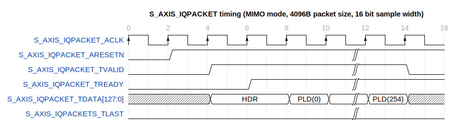
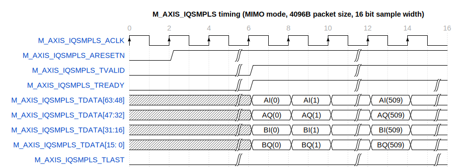

# Entity: TX_PATH_TOP 
- **File**: tx_path_top.vhd

## Diagram

## Description

Top module for unpacking stream packets, performing timestamp synchronisation if needed

Functionality:
- Perform timestamp synchronisation
- Unpack stream packets
- Output the data in a format suitable for lms7002_top module

 

 

 

## Generics

| Generic name | Type    | Value | Description                                                    |
| ------------ | ------- | ----- | -------------------------------------------------------------- |
| G_BUFF_COUNT | integer | 2     | Number of packet buffers to use. Recommended values are 2 or 4 |

## Ports

| Port name        | Direction | Type                          | Description                                                                                            |
| ---------------- | --------- | ----------------------------- | ------------------------------------------------------------------------------------------------------ |
| RESET_N          | in        | std_logic                     | Reset, active low                                                                                      |
| RX_SAMPLE_NR     | in        | std_logic_vector(63 downto 0) | Sample number to use for timestamp sync                                                                |
| RX_CLK           | in        | std_logic                     | Clock that RX_SAMPLE_NR is generated with                                                              |
| PCT_SYNC_DIS     | in        | std_logic                     | Disable timestamp sync                                                                                 |
| PCT_LOSS_FLG     | out       | std_logic                     | Goes high when a packet is dropped due to outdated timestamp, stays high until PCT_LOSS_FLG_CLR is set |
| PCT_LOSS_FLG_CLR | in        | std_logic                     | Clears PCT_LOSS_FLG                                                                                    |
| CFG_CH_EN        | in        | std_logic_vector(1 downto 0)  | Channel enable. "01" - Ch. A, "10" - Ch. B, "11" - Ch. A and Ch. B.                                    |
| CFG_SAMPLE_WIDTH | in        | std_logic_vector(1 downto 0)  | Sample width. "10"-12bit, "00"-16bit;                                                                  |
| s_axis_iqpacket  | in        | Virtual bus                   | AXIS bus for receiving packets                                                                         |
| m_axis_iqsample  | out       | Virtual bus                   | AXIS bus for outputting IQ samples                                                                     |

### Virtual Buses

#### s_axis_iqpacket

| Port name                | Direction | Type                          | Description                         |
| ------------------------ | --------- | ----------------------------- | ----------------------------------- |
| S_AXIS_IQPACKET_ARESET_N | in        | std_logic                     | S_AXIS interface active low reset   |
| S_AXIS_IQPACKET_ACLK     | in        | std_logic                     | S_AXIS interface clock              |
| S_AXIS_IQPACKET_TVALID   | in        | std_logic                     | S_AXIS interface data valid         |
| S_AXIS_IQPACKET_TDATA    | in        | std_logic_vector(63 downto 0) | S_AXIS interface data               |
| S_AXIS_IQPACKET_TREADY   | out       | std_logic                     | S_AXIS interface data ready         |
| S_AXIS_IQPACKET_TLAST    | in        | std_logic                     | S_AXIS interface data last (unused) |
#### m_axis_iqsample

| Port name                | Direction | Type                          | Description                         |
| ------------------------ | --------- | ----------------------------- | ----------------------------------- |
| M_AXIS_IQSAMPLE_ARESET_N | in        | std_logic                     | M_AXIS interface active low reset   |
| M_AXIS_IQSAMPLE_ACLK     | in        | std_logic                     | M_AXIS interface clock              |
| M_AXIS_IQSAMPLE_TVALID   | out       | std_logic                     | M_AXIS interface data valid         |
| M_AXIS_IQSAMPLE_TDATA    | out       | std_logic_vector(63 downto 0) | M_AXIS interface data               |
| M_AXIS_IQSAMPLE_TREADY   | in        | std_logic                     | M_AXIS interface data ready         |
| M_AXIS_IQSAMPLE_TLAST    | out       | std_logic                     | M_AXIS interface data last (unused) |

## Signals

| Name                      | Type                                                                                     | Description |
| ------------------------- | ---------------------------------------------------------------------------------------- | ----------- |
| axis_iqpacket_tvalid      | std_logic                                                                                |             |
| axis_iqpacket_tready      | std_logic                                                                                |             |
| axis_iqpacket_tdata       | std_logic_vector(127 downto 0)                                                           |             |
| axis_iqpacket_tlast       | std_logic                                                                                |             |
| p2d_wr_m_axis_areset_n    | std_logic                                                                                |             |
| p2d_wr_m_axis_tvalid      | std_logic_vector(G_BUFF_COUNT - 1 downto 0)                                              |             |
| p2d_wr_m_axis_tdata       | std_logic_vector(127 downto 0)                                                           |             |
| p2d_wr_m_axis_tready      | std_logic_vector(G_BUFF_COUNT - 1 downto 0)                                              |             |
| p2d_wr_m_axis_tlast       | std_logic_vector(G_BUFF_COUNT - 1 downto 0)                                              |             |
| p2d_wr_buf_empty          | std_logic_vector(G_BUFF_COUNT - 1 downto 0)                                              |             |
| p2d_rd_s_axis_areset_n    | std_logic                                                                                |             |
| p2d_rd_s_axis_buf_reset_n | std_logic_vector(G_BUFF_COUNT - 1 downto 0)                                              |             |
| p2d_rd_s_axis_tvalid      | std_logic_vector(G_BUFF_COUNT - 1 downto 0)                                              |             |
| p2d_rd_s_axis_tdata       | T_S_AXIS_TDATA_ARRAY(G_BUFF_COUNT - 1 downto 0)                                          |             |
| p2d_rd_s_axis_tready      | std_logic_vector(G_BUFF_COUNT - 1 downto 0)                                              |             |
| p2d_rd_s_axis_tlast       | std_logic_vector(G_BUFF_COUNT - 1 downto 0)                                              |             |
| rx_sample_nr_reg          | std_logic_vector(RX_SAMPLE_NR'left downto 0)                                             |             |
| rx_sample_nr_wr           | std_logic                                                                                |             |
| rx_sample_nr_rd           | std_logic                                                                                |             |
| pct_loss_flg_clr_reg      | std_logic                                                                                |             |
| pct_loss_flg_clr_reg_reg  | std_logic                                                                                |             |
| unpack_bypass             | std_logic                                                                                |             |
| usedw_vector              | T_USEDW_VECTOR                                                                           |             |
| p2d_wr_axis               | T_AXIS_ARRAY                                                                             |             |
| p2d_rd_axis               | T_AXIS_ARRAY                                                                             |             |
| smpl_unpack_axis          | t_AXI_STREAM(tdata(127 downto 0),  tkeep(0 downto 0)) |             |
| smpl_buf_axis             | t_AXI_STREAM(tdata(127 downto 0),  tkeep(0 downto 0)) |             |
| data_pad_axis             | t_AXI_STREAM(tdata(127 downto 0),  tkeep(0 downto 0)) |             |

## Constants

| Name              | Type    | Value | Description |
| ----------------- | ------- | ----- | ----------- |
| C_P2D_FIFO_USEDWW | integer | 9     |             |

## Types

| Name           | Type | Description |
| -------------- | ---- | ----------- |
| T_USEDW_VECTOR |      |             |
| T_AXIS_ARRAY   |      |             |

## Processes
- CDC: ( M_AXIS_IQSAMPLE_ACLK, M_AXIS_IQSAMPLE_ARESET_N )

## Instantiations

- rx_sample_nr_cdc: work.fifo_axis_wrap
- axis_dwidth_converter_64_to_128_inst: axis_dwidth_converter_64_to_128
- inst0_pct2data_buf_wr: work.pct2data_buf_wr
- inst2_pct2data_buf_rd: work.pct2data_buf_rd
- inst3_0_unpack_128_to_48: work.sample_padder
- inst3_1_mini_sample_buffer: work.fifo_axis_wrap
- inst3_sample_unpack: work.sample_unpack
