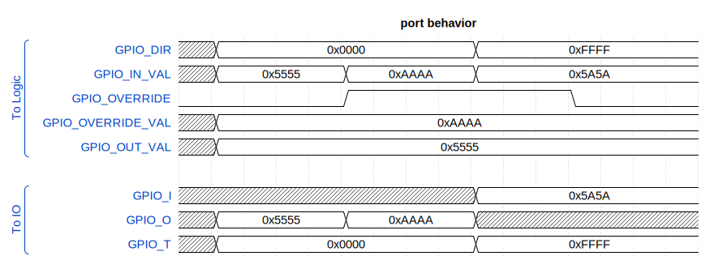

# Entity: GPIO_TOP 
- **File**: gpio_top.vhd

## Diagram

Basic module for GPIO signal control

Functionality:
- Provides a method to override regular output value
- Reading IO value always returns actual value of the port, regardless of GPIO direction chosen

## Generics

| Generic name | Type    | Value | Description     |
| ------------ | ------- | ----- | --------------- |
| G_GPIO_WIDTH | integer | 12    | Number of GPIOs |

## Ports

| Port name         | Direction | Type                                        | Description                            |
| ----------------- | --------- | ------------------------------------------- | -------------------------------------- |
| GPIO_DIR          | in        | std_logic_vector(G_GPIO_WIDTH - 1 downto 0) | GPIO direction (0 - Output, 1 - Input) |
| GPIO_OUT_VAL      | in        | std_logic_vector(G_GPIO_WIDTH - 1 downto 0) | GPIO output value                      |
| GPIO_IN_VAL       | out       | std_logic_vector(G_GPIO_WIDTH - 1 downto 0) | GPIO input value                       |
| GPIO_OVERRIDE     | in        | std_logic_vector(G_GPIO_WIDTH - 1 downto 0) | GPIO output override enable            |
| GPIO_OVERRIDE_VAL | in        | std_logic_vector(G_GPIO_WIDTH - 1 downto 0) | GPIO output override value             |
| GPIO_I            | in        | std_logic_vector(G_GPIO_WIDTH - 1 downto 0) | GPIO input (from IO)                   |
| GPIO_O            | out       | std_logic_vector(G_GPIO_WIDTH - 1 downto 0) | GPIO output (to IO)                    |
| GPIO_T            | out       | std_logic_vector(G_GPIO_WIDTH - 1 downto 0) | GPIO direction                         |

## Signals

| Name              | Type                                        | Description |
| ----------------- | ------------------------------------------- | ----------- |
| internal_gpio_out | std_logic_vector(G_GPIO_WIDTH - 1 downto 0) |             |

## Processes
- MUX: ( GPIO_DIR, GPIO_OUT_VAL, GPIO_OVERRIDE, GPIO_OVERRIDE_VAL, GPIO_I, internal_gpio_out )
