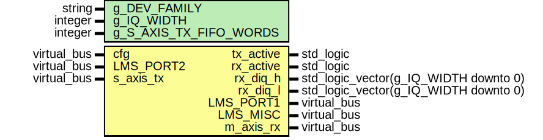
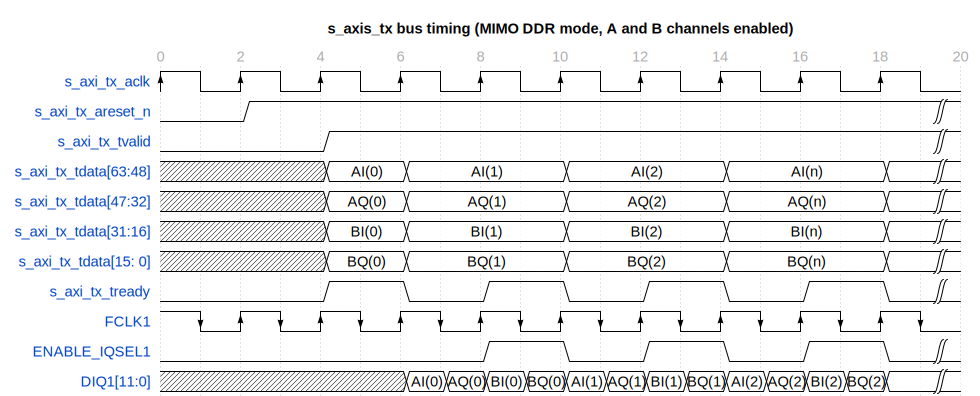
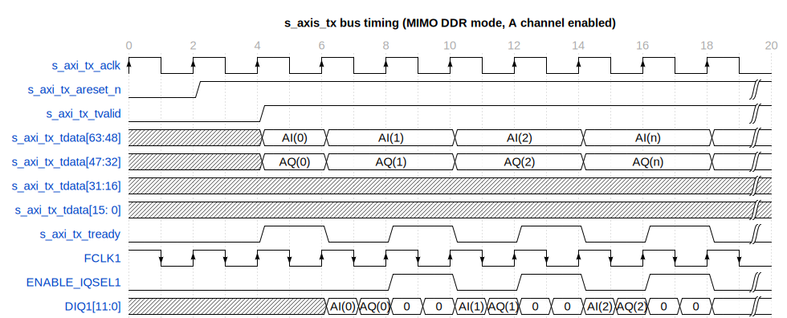
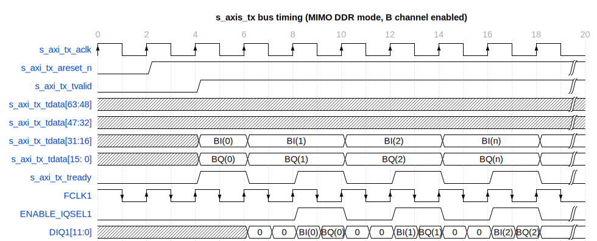
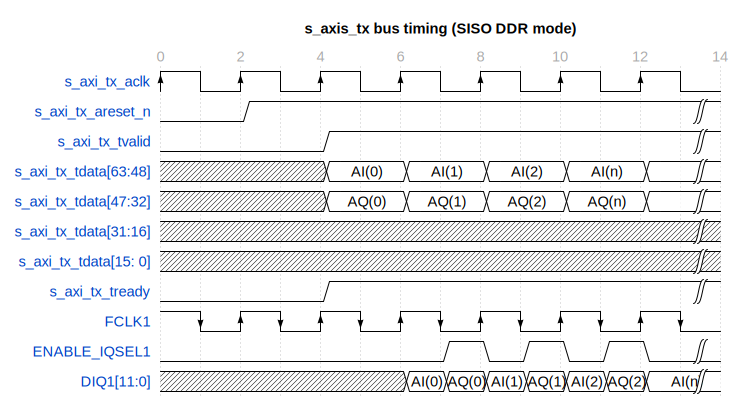
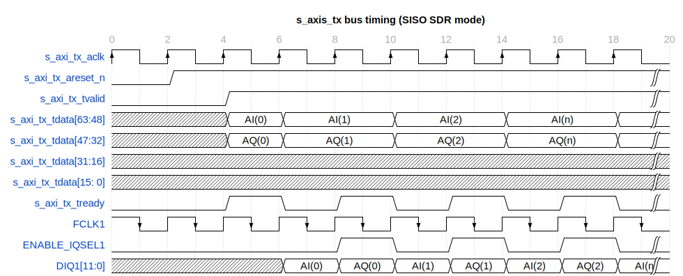

# Entity: lms7002_top 
- **File**: lms7002_top.vhd

## Diagram

## Description

Top module for LMS7002M IC.

Functionality:
- Transmit IQ samples trough s_axi_tx AXI Stream bus
- Receive IQ samples from m_axi_rx AXI Stream bus

LimeLight digital modes implemented:
- TRXIQ PULSE
- MIMO DDR
- SISO DDR
- SISO SDR

 

 

 

 

 

## Generics

| Generic name           | Type    | Value     | Description           |
| ---------------------- | ------- | --------- | --------------------- |
| g_DEV_FAMILY           | string  | "Artix 7" | Device family         |
| g_IQ_WIDTH             | integer | 12        | IQ bus width          |
| g_S_AXIS_TX_FIFO_WORDS | integer | 16        | TX FIFO size in words |

## Ports

| Port name | Direction | Type                                  | Description                                           |
| --------- | --------- | ------------------------------------- | ----------------------------------------------------- |
| tx_active | out       | std_logic                             | TX antenna enable flag                                |
| rx_active | out       | std_logic                             | RX sample counter enable                              |
| rx_diq_h  | out       | std_logic_vector(g_IQ_WIDTH downto 0) | Output of Direct capture on rising edge of DIQ2 port  |
| rx_diq_l  | out       | std_logic_vector(g_IQ_WIDTH downto 0) | Output of Direct capture on falling edge of DIQ2 port |
| cfg       | in        | Virtual bus                           | Configuration bus                                     |
| LMS_PORT1 | out       | Virtual bus                           | interface                                             |
| LMS_PORT2 | in        | Virtual bus                           | interface                                             |
| LMS_MISC  | out       | Virtual bus                           | LMS miscellaneous control ports                       |
| s_axis_tx | in        | Virtual bus                           | Transmit AXIS bus                                     |
| m_axis_rx | out       | Virtual bus                           | Receive AXIS bus                                      |

### Virtual Buses

#### cfg

| Port name    | Direction | Type           | Description                    |
| ------------ | --------- | -------------- | ------------------------------ |
| from_fpgacfg | in        | t_FROM_FPGACFG | Signals from FPGACFG registers |
| from_tstcfg  | in        | t_FROM_TSTCFG  | Signals from TSTCFG registers  |
| from_memcfg  | in        | t_FROM_MEMCFG  | Signals from MEMCFG registers  |
#### LMS_PORT1

| Port name     | Direction | Type                                    | Description                  |
| ------------- | --------- | --------------------------------------- | ---------------------------- |
| MCLK1         | in        | std_logic                               | TX interface clock           |
| FCLK1         | out       | std_logic                               | TX interface feedback clock  |
| DIQ1          | out       | std_logic_vector(g_IQ_WIDTH-1 downto 0) | DIQ1 data bus                |
| ENABLE_IQSEL1 | out       | std_logic                               | IQ select flag for DIQ1 data |
| TXNRX1        | out       | std_logic                               | LMS_PORT1 direction select   |
#### LMS_PORT2

| Port name     | Direction | Type                                    | Description                  |
| ------------- | --------- | --------------------------------------- | ---------------------------- |
| MCLK2         | in        | std_logic                               | RX interface clock           |
| FCLK2         | out       | std_logic                               | RX interface feedback clock  |
| DIQ2          | in        | std_logic_vector(g_IQ_WIDTH-1 downto 0) | DIQ2 data bus                |
| ENABLE_IQSEL2 | in        | std_logic                               | IQ select flag for DIQ2 data |
| TXNRX2        | out       | std_logic                               | LMS_PORT2 direction select   |
#### LMS_MISC

| Port name   | Direction | Type      | Description                     |
| ----------- | --------- | --------- | ------------------------------- |
| RESET       | out       | std_logic | LMS hardware reset, active low  |
| TXEN        | out       | std_logic | TX hard power off               |
| RXEN        | out       | std_logic | RX hard power off               |
| CORE_LDO_EN | out       | std_logic | LMS internal LDO enable control |
#### s_axis_tx

| Port name          | Direction | Type                          | Description                   |
| ------------------ | --------- | ----------------------------- | ----------------------------- |
| s_axis_tx_areset_n | in        | std_logic                     | TX interface active low reset |
| s_axis_tx_aclk     | in        | std_logic                     | TX FIFO write clock           |
| s_axis_tx_tvalid   | in        | std_logic                     | TX FIFO write request         |
| s_axis_tx_tdata    | in        | std_logic_vector(63 downto 0) | TX FIFO data                  |
| s_axis_tx_tready   | out       | std_logic                     | TX FIFO write full            |
| s_axis_tx_tlast    | in        | std_logic                     |                               |
#### m_axis_rx

| Port name          | Direction | Type                          | Description                               |
| ------------------ | --------- | ----------------------------- | ----------------------------------------- |
| m_axis_rx_areset_n | in        | std_logic                     | RX interface active low reset             |
| m_axis_rx_aclk     | in        | std_logic                     | RX FIFO read clock                        |
| m_axis_rx_tvalid   | out       | std_logic                     | Received data from DIQ2 port valid signal |
| m_axis_rx_tdata    | out       | std_logic_vector(63 downto 0) | Received data from DIQ2 port              |
| m_axis_rx_tready   | in        | std_logic                     |                                           |
| m_axis_rx_tlast    | out       | std_logic                     |                                           |

## Signals

| Name                   | Type                                   | Description |
| ---------------------- | -------------------------------------- | ----------- |
| inst2_diq_h            | std_logic_vector (g_IQ_WIDTH downto 0) |             |
| inst2_diq_l            | std_logic_vector (g_IQ_WIDTH downto 0) |             |
| rx_smpl_cmp_start_sync | std_logic                              |             |
| inst0_reset_n          | std_logic                              |             |
| inst1_fifo_0_reset_n   | std_logic                              |             |
| inst1_fifo_1_reset_n   | std_logic                              |             |
| inst1_clk_2x_reset_n   | std_logic                              |             |
| inst1_txant_en         | std_logic                              |             |
| int_mode               | std_logic                              |             |
| int_trxiqpulse         | std_logic                              |             |
| int_ddr_en             | std_logic                              |             |
| int_mimo_en            | std_logic                              |             |
| int_ch_en              | std_logic_vector(1 downto 0)           |             |
| int_fidm               | std_logic                              |             |
| lms_txen_int           | std_logic                              |             |
| lms_rxen_int           | std_logic                              |             |
| debug_tx_ptrn_en       | std_logic                              |             |

## Instantiations

- inst0_lms7002_tx: work.lms7002_tx
